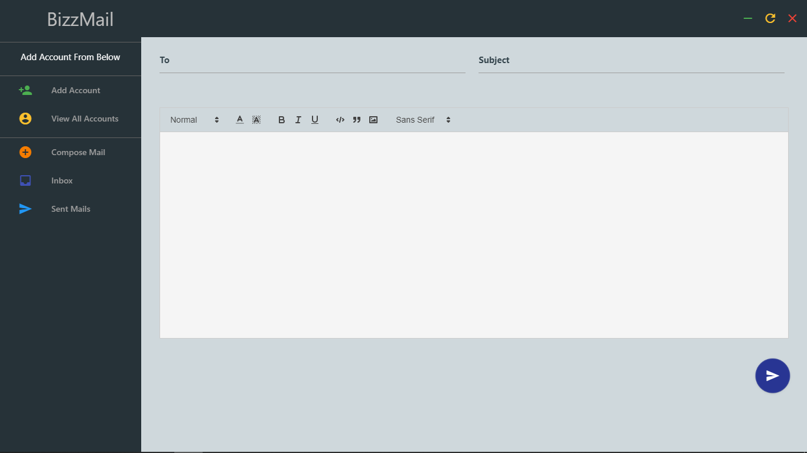

# Bizzmail
An Email Client for sending and receiving mails made with ElectronJS, NodeJS, etc

### Node Dependencies used
1. Express
2. EJS
3. Cheerio
4. Express-validator
5. inbox
6. nodemailer
7. nodemailer-plugin-inline-base64
8. mailparser

### Home

